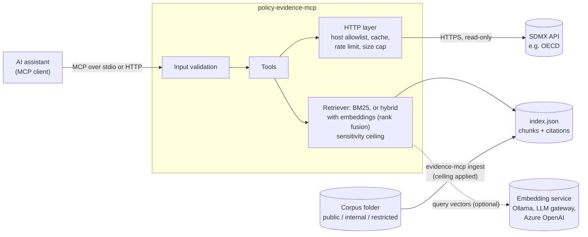

# policy-evidence-mcp

[](https://github.com/flam7791/policy-evidence-mcp/actions/workflows/ci.yml) [](LICENSE) 

An [MCP](https://modelcontextprotocol.io) server that gives AI assistants **governed, cited access
to two kinds of evidence**:

1. **Official statistics**, live from any SDMX 2.1 API (the OECD's public API by default):
   find a dataset, understand its dimensions, fetch observations with a citable source URL.
2. **Policy documents**, through a local retrieval (RAG) index with a **sensitivity ceiling**:
   documents above the configured classification are never indexed or returned. Search is by
   keywords (BM25), or **hybrid** (keywords plus meaning, from any embedding service).

The server does retrieval and citation. The client model (Claude, Copilot, ChatGPT or any
MCP-capable assistant) does the reasoning and writing. No language model runs inside the server;
hybrid search only calls an embedding model, which can be local.

> **Unofficial project.** Not affiliated with or endorsed by the OECD or any other data provider.
> Data retrieved through an API remains subject to that provider's terms of use. The sample
> document corpus describes a fictional organisation.

## Architecture



## Tools

| Tool | What it does | Output bounded by |
|---|---|---|
| `search_datasets` | Keyword search over the API's dataset catalogue | `limit` (max 50) |
| `describe_dataset` | Dimensions in key order, code lists, how to write a series key | `max_codes` per dimension |
| `find_codes` | Look up codes in one dimension ("germany" → `DEU`) | `limit` |
| `get_data` | Observations as a compact table, with source URL and citation | `max_rows` (max 1,000) and a 25 MB response cap |
| `search_documents` | Top passages for a question, each with a citation | `top_k` (max 10) × 1,200 characters |
| `list_documents` | Documents the server is cleared to show | clearance level |

Plus one prompt, `evidence_brief`, that tells the assistant how to answer from cited evidence.
All tools are declared read-only to clients (`readOnlyHint`).

A typical exchange: *"How does R&D spending as a share of GDP compare between France and
Germany, and are staff allowed to use restricted budget data with a chatbot?"* The assistant calls
`search_datasets` → `describe_dataset` → `get_data` for the figures and `search_documents` for the
rule, then answers with a source URL for each figure and a citation for each quotation.

## Quick start

Requires Python 3.10+.

```bash
python -m venv .venv
# Windows (PowerShell): .venv\Scripts\Activate.ps1      macOS/Linux: source .venv/bin/activate
pip install -e ".[dev]"

pytest                                                   # 93 offline tests, about 2 seconds

# The default ceiling is "public"; allow the sample's internal documents too.
export EVIDENCE_MCP_MAX_CLASSIFICATION=internal   # PowerShell: $env:EVIDENCE_MCP_MAX_CLASSIFICATION="internal"
evidence-mcp ingest --corpus sample_corpus
evidence-mcp search "who approves a high-risk AI use case"
evidence-mcp eval --questions evals/sample_questions.jsonl
python scripts/smoke_live.py                             # 3 live requests to the OECD API
```

To index your own documents, put `.md`, `.txt` or `.pdf` files in a folder (sub-folders named
`public`, `internal` or `restricted` set the classification) and run
`evidence-mcp ingest --corpus <folder>`. The `corpus/` and `index/` folders are git-ignored.

### Connect an assistant

Claude Desktop (`claude_desktop_config.json`), Windows example:

```json
{
  "mcpServers": {
    "policy-evidence": {
      "command": "C:\\path\\to\\policy-evidence-mcp\\.venv\\Scripts\\evidence-mcp.exe",
      "args": ["serve"],
      "env": {
        "EVIDENCE_MCP_INDEX_PATH": "C:\\path\\to\\policy-evidence-mcp\\index\\index.json",
        "EVIDENCE_MCP_MAX_CLASSIFICATION": "internal"
      }
    }
  }
}
```

To inspect the tools interactively: `npx @modelcontextprotocol/inspector evidence-mcp serve`.

Over HTTP (for clients that connect by URL):

```bash
evidence-mcp serve --transport streamable-http --port 8000     # http://127.0.0.1:8000/mcp
docker build -t policy-evidence-mcp . && docker run --rm -p 127.0.0.1:8000:8000 policy-evidence-mcp
```

## Configuration

All settings are environment variables with safe defaults.

| Variable | Default | Purpose |
|---|---|---|
| `EVIDENCE_MCP_SDMX_BASE_URL` | `https://sdmx.oecd.org/public/rest` | Any SDMX 2.1 REST endpoint (HTTPS only) |
| `EVIDENCE_MCP_INDEX_PATH` | `index/index.json` | Document index to serve |
| `EVIDENCE_MCP_MAX_CLASSIFICATION` | `public` | Highest level indexed and returned: `public`, `internal`, `restricted` |
| `EVIDENCE_MCP_CACHE_DIR` | `~/.cache/evidence-mcp` | HTTP cache and rate-limit state |
| `EVIDENCE_MCP_RATE_LIMIT_PER_HOUR` | `50` | Upstream requests per hour (the OECD allows about 60) |
| `EVIDENCE_MCP_HTTP_TIMEOUT` | `30` | Seconds per upstream request |
| `EVIDENCE_MCP_EMBEDDINGS_URL` | none | OpenAI-compatible embeddings endpoint; unset = keywords only |
| `EVIDENCE_MCP_EMBEDDINGS_MODEL` | `nomic-embed-text` | Embedding model (`auto` through a gateway) |
| `EVIDENCE_MCP_EMBEDDINGS_API_KEY` | none | Key for that endpoint, if it needs one |
| `EVIDENCE_MCP_TOKENS_FILE` | `tokens.json` | Hashed tokens for `--auth tokens` |
| `EVIDENCE_MCP_ENTRA_TENANT_ID` / `_AUDIENCE` | none | Entra ID tenant and the API's Application ID URI, for `--auth entra` |
| `EVIDENCE_MCP_ENTRA_SCOPE` | `Evidence.Read` | Delegated scope a token must carry |
| `EVIDENCE_MCP_ENTRA_ROLES` | `Evidence.Public=public,...` | App role to clearance mapping |

## Security model

Tool arguments come from a language model, and document text may contain anything, so both are
treated as untrusted.

- **Read-only by construction.** No tool writes, sends or deletes. The only network destination
  is the configured API base URL; the model cannot supply a URL (no SSRF).
- **Strict input validation.** Every identifier, key and period is matched against a narrow
  pattern before it reaches a URL, which rules out path and query injection.
- **Sensitivity ceiling, applied twice.** Documents above the ceiling are skipped at ingestion,
  and results are filtered again at query time in case an index was built with a higher
  clearance than the server runs with. The index records only the *number* of excluded
  documents, not their file names. Unknown labels are treated as most sensitive.
- **Untrusted content marked as such.** Control and zero-width characters are stripped at
  ingestion, and every search result tells the client that passages are data, not instructions
  (a mitigation for indirect prompt injection, not a guarantee).
- **Bounded responses and resource use.** Row, code, passage and byte caps; timeouts; brief
  retries with backoff; a persisted hourly rate limit so restarts cannot exceed the provider's
  quota.
- **Transport.** stdio for local use (logs go to stderr so they never corrupt the protocol
  stream). The HTTP transport binds to 127.0.0.1 by default and rejects requests whose `Host`
  header is not allowed (DNS-rebinding protection).
- **Authenticated callers, each with their own clearance (0.3).** Over HTTP the server requires
  a bearer token (its own hashed tokens, or Entra ID access tokens) and refuses to start on a
  network address without one unless told the network itself is the boundary. Each caller sees
  documents up to the lower of the server's ceiling and their own clearance. See
  [Access management](#access-management-03).

## Access management (0.3)

Over HTTP, every request needs a bearer token, and each caller sees documents up to **the lower
of the server's ceiling and their own clearance**. Statistics are public and need only a valid
token. The server publishes OAuth protected-resource metadata, so MCP clients that support OAuth
discover where to get a token; requests without one get `401` with a pointer to it.

**Tokens issued by the server** (a team server or a pilot):

```bash
evidence-mcp token create --name alice --clearance public     --tokens-file tokens.json
evidence-mcp token create --name bob   --clearance internal   --tokens-file tokens.json
evidence-mcp serve --transport streamable-http --auth tokens --tokens-file tokens.json
```

Tokens are shown once and stored only as SHA-256 hashes; `token revoke --name alice` removes one.

**Microsoft Entra ID** (an organisation): the server validates access tokens issued for its API
(signature against the tenant's published keys, issuer, audience, expiry, the `Evidence.Read`
scope) and reads the clearance from **app roles** assigned in Entra (`Evidence.Public`,
`Evidence.Internal`, `Evidence.Restricted`, highest wins). Who may see what is then managed where
the organisation already manages access: by assigning users or groups to roles.

```bash
export EVIDENCE_MCP_ENTRA_TENANT_ID=<tenant id>
export EVIDENCE_MCP_ENTRA_AUDIENCE=api://policy-evidence
evidence-mcp serve --transport streamable-http --host 0.0.0.0 --auth entra \
    --public-url https://evidence.example.org/mcp --allowed-host evidence.example.org
```

The app registration (exposed API, scope, app roles, assignment) is described step by step in
[docs/entra-id.md](docs/entra-id.md).

Serving on a network address without authentication is refused, unless
`--allow-unauthenticated` states that a private network is the boundary (as inside the platform's
container network, where only the agents service can reach the server). Every document search
logs the caller and the ceiling applied, never the query text.

## Cost and sustainability

- **Server side:** no model calls, so no token cost; statistics are cached (catalogue 24 h,
  structures 7 days, data 1 h), which also keeps load on the public API low.
- **Client side:** tokens are driven by what tools return, so outputs are compact. `get_data`
  lifts columns that are identical on every row into `constant_columns` (typically halving the
  table), and every tool has a size cap with a hint on how to narrow the query.

## Evaluation

`evals/sample_questions.jsonl` holds 16 labelled questions over the sample corpus: 12 direct, 2
paraphrased, and 2 *security* questions that ask about the restricted document, which must never
come back. `evidence-mcp eval` reports hit@1, hit@k, mean reciprocal rank and leaks; CI fails on
any leak or if hit@3 drops below 0.8.

Current baseline (ceiling `internal`, k = 3):

| hit@1 | hit@3 | MRR | leaks |
|---|---|---|---|
| 0.93 | 0.93 | 0.93 | 0 |

The one miss is instructive. *"Can employees rely on a chatbot to pick which job applicants to
hire?"* shares no words with the policy, which says *"Staff must not use AI tools to make
decisions about individuals, such as recruitment"*. Keyword retrieval cannot bridge that
vocabulary gap.

`evals/paraphrase_questions.jsonl` makes the gap measurable: 13 questions worded the way people
ask rather than the way policies are written, plus a security question. Keyword search finds the
right document in the top 3 for **0.54** of them (hit@1 0.46, MRR 0.52, no leaks).

## Hybrid search (0.2)

Hybrid search adds meaning to keywords. At ingest, every chunk also gets an embedding vector; at
query time, the keyword ranking and the similarity ranking are merged by **reciprocal rank
fusion** (each chunk scores the sum of 1 / (60 + rank) over both lists). Any OpenAI-compatible
embeddings endpoint works: a **local model through Ollama** (nothing leaves the machine), an
internal **LLM gateway** (which applies the data policy and records the cost) or **Azure
OpenAI**.

```bash
ollama pull nomic-embed-text
export EVIDENCE_MCP_EMBEDDINGS_URL=http://localhost:11434/v1
export EVIDENCE_MCP_MAX_CLASSIFICATION=internal
evidence-mcp ingest --corpus sample_corpus --embeddings --embeddings-cache evals/embeddings.json
evidence-mcp eval --questions evals/paraphrase_questions.jsonl --mode compare \
  --embeddings-cache evals/embeddings.json
```

The comparison prints hit@1, hit@3, MRR and leaks for both modes. The cache file records every
vector, so the same comparison replays offline (`--offline`) in CI once it is committed.

### Results (live run, October 2026)

`nomic-embed-text` through Ollama on a laptop, ceiling `internal`, k = 3. CI replays these
vectors on every push.

| Question set | Mode | hit@1 | hit@3 | MRR | Leaks |
|---|---|---|---|---|---|
| Direct questions (16) | keywords | 0.93 | 0.93 | 0.93 | 0 |
| | **hybrid** | **1.00** | **1.00** | **1.00** | 0 |
| Paraphrases (14) | keywords | 0.46 | 0.54 | 0.52 | 0 |
| | **hybrid** | **0.69** | **0.77** | **0.77** | 0 |

Hybrid search closes the gap on the direct questions (it now finds *"Can employees rely on a
chatbot to pick which job applicants to hire?"*) and lifts the paraphrases from about half to
three quarters, with no leak in either mode. Three paraphrases still miss, for example *"Which
committee signs off on AI projects that affect people?"*, where the answer says "Digital
Governance Board". That is the case for a reranker, next on the roadmap.

Rules that keep it safe:

- **Documents above the ceiling are never sent for embedding**, and the ceiling filters the
  meaning side of search exactly like the keyword side.
- **One model per index.** The index records the model that made its vectors. If the service
  answers with another model, or is down, search uses keywords only and says so in its result
  (`search_mode`), rather than mixing incomparable vectors or failing.
- Each result says whether it was found by keywords, by meaning, or both (`matched_by`).

In [governed-ai-platform](https://github.com/flam7791/governed-ai-platform), the server runs as
an internal container, re-indexes at start with a local embedding model through the LLM gateway
(whose `local_only` policy guarantees document text never leaves), and serves the agents over
MCP.

## Limitations and roadmap

- [x] **Hybrid retrieval**: embeddings alongside BM25 with rank fusion, compared on the same
      evaluation (0.2)
- [ ] **Reranking**: a cross-encoder or model-based reranker over the fused top 20, if the
      evaluation shows it pays for its latency.
- [ ] **Codes with data only**: use SDMX `availableconstraint` so `describe_dataset` lists only
      codes that actually have observations.
- [ ] **Structured tool output**: typed results with output schemas.
- [x] **Identity-aware access**: bearer tokens or Entra ID, documents filtered per caller (0.3)
- [ ] **Observability**: request tracing with OpenTelemetry (supported by the MCP SDK), cache hit
      rate and upstream latency.
- [ ] **More providers**: the SDMX client is provider-neutral; test against ECB and Eurostat.

## Project layout

```
src/evidence_mcp/
  server.py       MCP tools and prompt
  sdmx.py         SDMX client and parsers (catalogue, structure, CSV data)
  http_cache.py   host allowlist, disk cache, rate limit, retries, size cap
  documents.py    loading (md/txt/pdf), metadata, heading-aware chunking
  retrieval.py    BM25 and hybrid search, sensitivity ceiling, index files
  embeddings.py   OpenAI-compatible embeddings client, recorded vectors for replay
  evaluation.py   hit@k, MRR, leak detection
  validation.py   input patterns
  config.py       settings and classification levels
  cli.py          serve | ingest | search | eval
tests/            offline unit, protocol and end-to-end tests with recorded fixtures
evals/            labelled question sets
sample_corpus/    fictional documents for tests and demos
docs/             design decisions
```

## Development

```bash
pytest              # all tests, offline
ruff check . && ruff format --check .
```

CI (GitHub Actions) runs lint, tests and the retrieval evaluation on Python 3.10 to 3.13, then
builds the Docker image. See [docs/design-decisions.md](docs/design-decisions.md) for the
reasoning behind the main choices.

## License

MIT. See [LICENSE](LICENSE).
