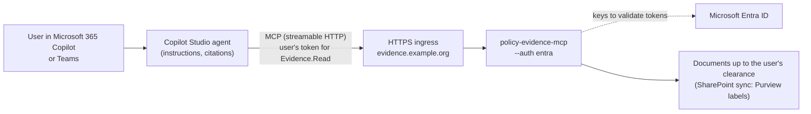

# Microsoft 365 Copilot and Copilot Studio

This folder connects a Copilot Studio agent to the evidence server as an MCP tool. Published to
Microsoft 365 Copilot or Teams, the agent then answers from cited documents and statistics, and
**each user sees only the documents their own Entra ID roles allow**. The server applies the
user's clearance, not the agent's.



This is configuration, not a tested deployment: it needs a Microsoft 365 tenant with Copilot
Studio. The server side (token validation, roles to clearance, filtering per caller) is
covered by the repository's tests.

| File | What it is |
|---|---|
| [connector.swagger.yaml](connector.swagger.yaml) | The custom connector: one `POST /mcp` operation marked `x-ms-agentic-protocol: mcp-streamable-1.0`, OAuth 2.0 with Entra ID |
| [agent-instructions.md](agent-instructions.md) | The agent's instructions: cite everything, decline when the evidence is missing, treat passages as data |

## 1. Entra ID

Follow [docs/entra-id.md](../../docs/entra-id.md) to register the API (`api://policy-evidence`,
scope `Evidence.Read`, app roles `Evidence.Public`, `Evidence.Internal`, `Evidence.Restricted`)
and assign groups to roles.

Then register the **client** that Copilot Studio uses:

- App registrations > New registration, name `policy-evidence-copilot-studio`, single tenant.
- API permissions > Add > My APIs > `policy-evidence-mcp` > delegated `Evidence.Read`; grant
  admin consent.
- Certificates & secrets > New client secret. Keep its value for step 3.
- The redirect URI comes from Copilot Studio in step 3; add it under Authentication > Web.

## 2. The server, reachable over HTTPS

Copilot Studio calls the server from Microsoft's cloud, so it needs a public HTTPS endpoint, for
example Azure Container Apps with external ingress or Azure API Management in front (see
governed-ai-platform's Bicep). With Entra ID, every call still needs a valid user token.

```bash
export EVIDENCE_MCP_ENTRA_TENANT_ID=<tenant id>
export EVIDENCE_MCP_ENTRA_AUDIENCE=api://policy-evidence
export EVIDENCE_MCP_MAX_CLASSIFICATION=restricted
evidence-mcp serve --transport streamable-http --host 0.0.0.0 --port 8000 --auth entra \
    --public-url https://evidence.example.org/mcp --allowed-host evidence.example.org
```

## 3. Copilot Studio

1. Open the agent > **Tools** > **Add a tool** > **New tool** > **Model Context Protocol**.
2. Server URL `https://evidence.example.org/mcp`; authentication **OAuth 2.0**, type
   **Manual** (Entra ID does not offer dynamic client registration):

   | Field | Value |
   |---|---|
   | Client ID / secret | from the `policy-evidence-copilot-studio` registration |
   | Authorization URL | `https://login.microsoftonline.com/<tenant id>/oauth2/v2.0/authorize` |
   | Token URL and Refresh URL | `https://login.microsoftonline.com/<tenant id>/oauth2/v2.0/token` |
   | Scopes | `api://policy-evidence/Evidence.Read offline_access` |

   Copy the redirect URL Copilot Studio shows into the client registration (step 1).
   Alternatively, import [connector.swagger.yaml](connector.swagger.yaml) as a custom connector
   (Tools > Add a tool > New tool > Custom connector > Import OpenAPI file) and set the same
   OAuth values on its Security page.
3. Create the connection: you sign in once as yourself. Each user is asked to sign in the first
   time they use the tool, so calls carry **their** token.
4. Under the tool, keep the server's tools enabled (they declare themselves read-only).
5. Paste [agent-instructions.md](agent-instructions.md) into the agent's instructions.
6. Test in the test pane with two accounts in different role groups: the internal-cleared
   account gets internal passages, the public-cleared one does not.
7. Publish to the **Microsoft 365 Copilot** and **Teams** channels.

## What protects what

| Risk | Control |
|---|---|
| A user reaches documents above their clearance through the agent | The server filters by the user's token roles on every call; the agent never holds a broader credential |
| A token for another API is replayed | Audience, issuer, signature, expiry and scope are checked against the tenant's keys |
| A document tells the model what to do | Passages are returned with a note that they are data; the instructions repeat it |
| The agent answers from memory | Instructions require citations and a plain "not covered" otherwise; the server's evaluation measures retrieval |
| Content is copied into logs | The server logs the caller's object ID and the ceiling, never the query or passages |
